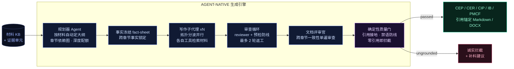
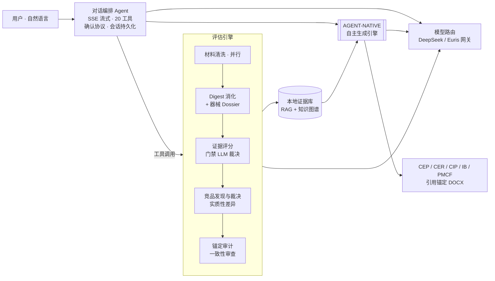

<div align="center">

# ⬡ MEDEVAL ⬡

### ⟢ AI-NATIVE REGULATORY INTELLIGENCE ENGINE ⟣
#### 医疗器械申报评估 · 自主循证文档生成工作台

<br/>


<br/>

```
      ╔══════════════════════════════════════════════════════════════╗
      ║   PLAN ▸ RETRIEVE ▸ WRITE ▸ REVIEW ▸ CRITIQUE ▸ GATE          ║
      ║   自主大纲   工具检索   多智能体   自我审查   跨章一致   门禁    ║
      ╚══════════════════════════════════════════════════════════════╝
```

> **一句话操控整条申报流水线** — 上传材料 ▸ 智能清洗 ▸ 循证评估 ▸ 竞品对比 ▸ 结果追问 ▸ **自主生成 CEP / CER / CIP / IB / PMCF 草稿**。
> 全流程大模型驱动(AI-native,无关键词规则兜底决策)· 降级透明 · 重操作确认 · 引用可追溯。

**⚠ 本仓库为项目展示页,不含源码。**


</div>

---

## ✦ 最新战报 ── 自主生成引擎重构 `AGENT-NATIVE ENGINE`

> 把申报文档生成从**写死的模板**,重构为一个**高自由度的多智能体自主引擎**。
> 它不再按固定章节填空,而是像一位法规撰稿人:**自己读材料、自己定大纲、自己写、自己审、自己查一致性**。



### ⟢ 引擎为什么强

| 能力 | 机制 |
|---|---|
| **自主大纲** | 规划器读材料后**按实际内容**生成章节结构、深度配额与依赖图 —— 不是固定模板填空 |
| **多智能体并行写作** | 章节按拓扑排序分波,同波并行;每个写作子代理**独立用工具检索材料**(search / read),按需取证 |
| **硬引用接地** | 每句主张都锚定真实材料 chunk id;运行时 seen-set 只允许引用真实取到的证据 |
| **零幻觉** | 材料里没有的事实一律写成 `[MISSING: …]`,**绝不编造**;规划纪律防线拦截越界结论措辞 |
| **跨章一致性** | 文档评审官单遍通读全文,统一术语 / 消除矛盾,再做结构化装配 |
| **诚实门禁** | 引用为零的"空壳文档"被 `ungrounded_document` 门禁直接拦截 —— **宁可不出,不出无据** |
| **断点续跑** | 大纲 / 事实表 / 每章结果落盘;重跑同一任务只补跑失败章节,不重烧算力 |
| **抗抖动自愈** | 上游 LLM 空回复时干净重试 + 失败章节自动串行救援,不让并发争用毁掉整篇 |

### ⟢ 实测 ── 单份 CEP 全文档生成

> 真实材料:某 OCD 脑深部电刺激(DBS)系统 · 197 份源文件

```
╭─────────────────────────────────────────────────────────────╮
│  DOCUMENT            Clinical Evaluation Plan (CEP)           │
│  SECTIONS            24   自主规划 · 拓扑分波并行            │
│  WORDS               27,194                                   │
│  CITATIONS           123  全部锚定真实材料 chunk             │
│  HONEST GAPS         51   [MISSING] 诚实标注 · 零编造        │
│  REVISION ROUNDS     1.1  平均 · 禁语防线降返工              │
│  QUALITY GATE        PASSED_WITH_FLAGS   (0 errors)          │
╰─────────────────────────────────────────────────────────────╯
```

### ⟢ 双引擎架构

```
   ┌──────────────────────────┐        ┌──────────────────────────┐
   │  [1] AGENT_NATIVE (默认) │        │  [2] SECTION_FIRST (兜底)│
   │  规划+工具检索+多智能体   │  <==>  │  秒级直写 · 证据足时快出  │
   │  智能 · 深 · 抗材料异构   │        │  轻量 · 快 · 依赖前置抽取  │
   └──────────────────────────┘        └──────────────────────────┘
   旧 Hermes / agentic 三号路径已退役 ▸ 净删除 2,350 行,只留两条主干
```

---

## ✦ 它是什么

MedEval 是一个**本地优先**的医疗器械申报辅助工作台,面向 FDA 510(k) / PMA / BDD、EU MDR、NMPA 五个申报路径:

- **像用 ChatGPT 一样用它** — 入口是对话界面,自然语言即操作;执行功能时自动弹出可拖拽浮动窗口实时展示
- **AI-native 流水线** — 材料消化 → 器械档案 → 证据评分 → 竞品裁决与实质性差异对比 → 锚定审计 → 一致性审查,每步由大模型判断,不用硬编码关键词
- **循证文档生成** — 上文的自主生成引擎,逐段引用锚定源文件位置,引用不可解析则质量门禁拦截

## ✦ 界面速览

### 对话驱动 · 确认协议 · 实时进度
重量级操作(启动评估 / 生成)和破坏性操作(删除 / 清理)由编排层强制拦截弹卡,用户点击才执行 —— 不靠模型自觉。长任务里程碑自动播报进对话流。


### 评估结果 · 评分环 · 降级透明 · 维度下钻
每环节标明"大模型完成"还是"脚本兜底"(绿 / 黄徽章);维度行可展开评价叙述与强弱项。


### 竞品实质性差异(非参数对齐)
对比意见按"事实 → 机理 → 审评后果"组织,直指对照器械数据缺口对等同性论证的影响。


### 文档生成 · 质量门禁诚实拦截
材料不足时被 `ungrounded_document` 拦截并给补料建议;证据充分则产出带完整引用映射的 DOCX / Markdown。


### 模型路由 · DeepSeek 直连 + Euris 中转网关
编排与评估 / 生成全阶段模型一键切换并保持对齐:GPT · Qwen · Kimi · GLM · DeepSeek 系均可选,密钥全程留在服务端。


### 专业报告视图(经典模式)与移动端
<table>
  <tr>
    <td width="62%"></td>
    <td width="38%"></td>
  </tr>
</table>

---

## ✦ 系统架构总览



## ✦ 设计原则

| 原则 | 落地方式 |
|---|---|
| **AI-native** | 选择 / 过滤 / 裁决一律大模型完成;工具描述即路由 Prompt;关键词扫描仅作无模型兜底 |
| **降级透明** | 每环节标注 `llm` 或 `fallback`,前端徽章可见,绝不静默降级 |
| **重操作确认** | 编排层强制 confirm ticket:重量级 / 破坏性工具被拦截弹卡,点击才执行 |
| **引用可追溯** | 生成文档逐段编号引用 → 证据单元 → 源文件位置;引用为零直接拦截 |
| **本地优先** | 材料、证据库、会话全部本地存储;模型密钥不出服务端 |

## ✦ 状态

- 定位:**专家辅助草稿引擎** — 产出需由法规事务(RA)专业人员复核,不构成申报建议
- 生成引擎:六模板全接入(CEP · CER · CIP · IB · PMCF Plan · PMCF Synopsis),`agent_native` 为默认智能引擎,`section_first` 为快速兜底
- 界面:对话工作台(v2,主入口)+ 经典专业界面双模式
- 核心代码为私有仓库;本仓库仅作项目展示,合作或试用请通过 Issue 联系

## ✦ 技术栈

`FastAPI` · `React 19 + Vite` · `SSE 流式 + OpenAI 工具调用协议` · 多智能体编排(规划 / 写作 / 审查 / 评审官)· 本地混合 RAG(词法 + 语义)· 知识图谱 · `DeepSeek / Euris` 模型网关(GPT / Qwen / Kimi / GLM)· Playwright 全流程旅程回归

<div align="center">
<br/>

`⟢ built for regulatory-grade evidence, not vibes ⟣`

</div>
