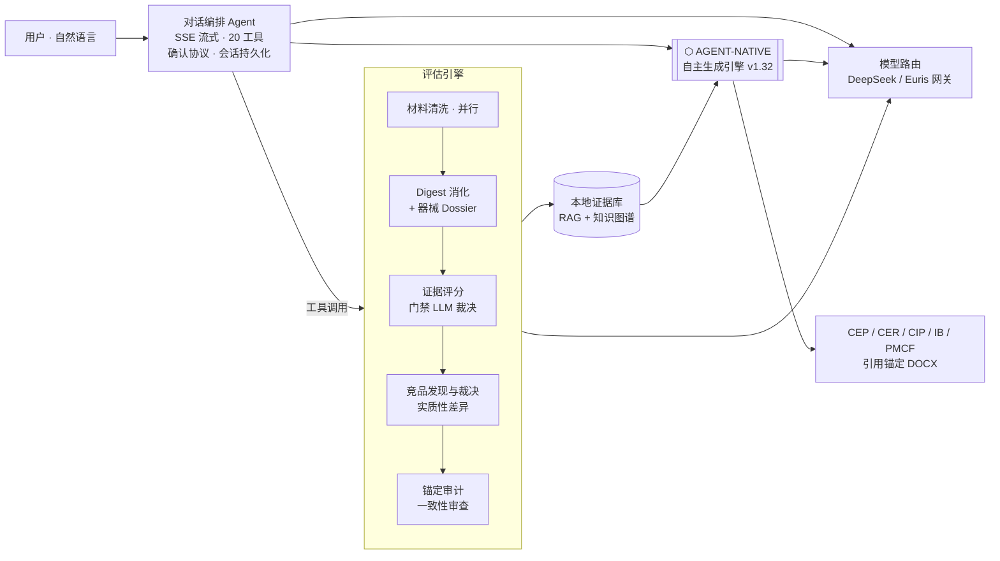

<div align="center">

# ⬡ MEDEVAL ⬡

### ⟢ AUTONOMOUS REGULATORY INTELLIGENCE ⟣
#### 医疗器械申报评估 · 自主循证文档生成工作台

<br/>


<br/>

```
   ╔══════════════════════════════════════════════════════════════════════╗
   ║   CURATE ▸ PLAN ▸ FREEZE ▸ RETRIEVE ▸ WRITE ▸ REVIEW ▸ CRITIQUE ▸ GATE ║
   ║   语料预筛  自主大纲  事实冻结  工具检索  多智能体  审查  跨章一致  门禁 ║
   ╚══════════════════════════════════════════════════════════════════════╝
```

> **一句话操控整条申报流水线** — 上传材料 ▸ 智能清洗 ▸ 循证评估 ▸ 竞品对比 ▸ 结果追问 ▸ **自主生成 CEP / CER / CIP / IB / PMCF 草稿**。
> 全流程大模型驱动 · 引用锚定源文件 · 降级透明 · 重操作确认 · 本地优先。

**⚠ 本仓库为项目展示页,不含源码。**


</div>

---

## ✦ v1.32 更新 ── 自主生成引擎再进化 `AGENT-NATIVE 2.0`

> 这一版把生成引擎打磨成一位**会自己筛材料、自己查文献、自己排版、自己审校**的法规撰稿人。
> 五项能力(E2–E5)一次落地,从"骨架草稿"跃升到"完整、可追溯、更快"的合规初稿。

| 能力 | 做了什么 | 效果 |
|:--:|---|---|
| 🗂 **语料预筛** | 生成前按临床评价相关度给材料打分排序,只喂高信号核心文档 | 实测 124 份 → 25 份,**汰噪提质 + 提速** |
| 📚 **文献合成** | 探测语料里的 meta 分析/临床研究,抽出量化基准表(响应率/效应量/CI),硬接地引用 | SOTA 章有**真实文献基准**,不再空泛 |
| 📑 **前置件 + 书目** | 确定性生成文档控制表、目录、缩略语表、**编号书目 + "Cited in §N" 追溯** | 结构完整度**追平顾问级成品** |
| ⚡ **事实前置提速** | 事实一次冻结进 fact-sheet,每章优先复用、少重复检索 | 每章少几轮往返,**修订轮数 1.1 → 0.82** |
| 🛡 **规划纪律** | planning-only 防线只扫写手正文,前置件不误伤;禁语正则精准化 | CEP 不越界写 CER 结论,**gate 干净通过** |

<div align="center">

`v1.32 = 更完整的结构 · 更干净的语料 · 更真的文献 · 更快的生成 · 更严的接地`

</div>

---

## ✦ 自主生成引擎 ── 它怎么写出一份 CEP

```mermaid
flowchart LR
    UP[(上传材料<br/>N 份原始文件)]:::src --> CU
    subgraph ENGINE [AGENT-NATIVE 生成引擎 v1.32]
        direction LR
        CU[🗂 语料预筛<br/>相关度排序<br/>汰噪留核心]:::new
        PL[🧭 规划器 Agent<br/>按材料定大纲<br/>依赖图 · 深度配额]:::ag
        FS[❄ 事实冻结<br/>fact-sheet]:::ag
        LT[📚 文献摘要<br/>SOTA 量化基准]:::new
        W[✍ 写作子代理 xN<br/>拓扑分波并行<br/>工具检索材料]:::ag
        R[⟲ 审查循环<br/>reviewer + 防线]:::ag
        CR[⚖ 文档评审官<br/>跨章一致性]:::ag
        AS[📑 装配<br/>前置件 + 编号书目]:::new
        G[🛡 确定性质量门<br/>引用接地 · 零引用即拦截]:::gate
        CU --> PL --> FS --> LT --> W --> R --> CR --> AS --> G
    end
    G -->|passed| DOC[📄 CEP / CER / CIP / IB / PMCF<br/>引用锚定 Markdown + DOCX]:::out
    G -->|ungrounded| BLK[⛔ 诚实拦截 + 补料建议]:::blk

    classDef src fill:#0b1020,stroke:#3a4a80,color:#9fb4ff
    classDef ag fill:#101a33,stroke:#6c8cff,color:#cfe0ff
    classDef new fill:#161033,stroke:#b06cff,color:#e6d4ff
    classDef gate fill:#1a1030,stroke:#b06cff,color:#e6d4ff
    classDef out fill:#08251c,stroke:#00e5a0,color:#9affd8
    classDef blk fill:#2a0f1a,stroke:#ff5c8a,color:#ffb3c9
```



### ⟢ 核心不变量

| 不变量 | 机制 |
|---|---|
| **硬引用接地** | 每句主张锚定真实材料 chunk id;运行时 seen-set 只允许引用真实检索到的证据 —— **引用不可伪造** |
| **零幻觉** | 材料没有的事实一律写成 `[MISSING: …]`,绝不编造研究/数字 |
| **诚实门禁** | 引用为零的"空壳文档"被 `ungrounded_document` 直接拦截 —— 宁可不出,不出无据 |
| **跨章一致** | 文档评审官单遍通读全文,统一术语、消除矛盾,再装配 |
| **断点续跑** | 大纲 / 事实表 / 文献摘要 / 每章结果落盘,重跑只补失败章节 |
| **双引擎** | `agent_native`(智能,默认)+ `section_first`(快速兜底);旧 Hermes 路径已退役,净删 2,350 行 |

---

## ✦ 界面速览

### 对话驱动 · 确认协议 · 实时进度
重量级操作(启动评估 / 生成)和破坏性操作由编排层强制拦截弹卡,用户点击才执行 —— 不靠模型自觉。长任务里程碑自动播报进对话流。


### 评估结果 · 评分环 · 降级透明 · 维度下钻
每环节标明"大模型完成"还是"脚本兜底"(绿 / 黄徽章);维度行可展开评价叙述与强弱项。


### 竞品实质性差异(非参数对齐)
对比意见按"事实 → 机理 → 审评后果"组织,直指对照器械数据缺口对等同性论证的影响。


### 文档生成 · 质量门禁诚实拦截
材料不足被 `ungrounded_document` 拦截并给补料建议;证据充分则产出带完整引用映射的 DOCX / Markdown。


### 模型路由 · DeepSeek 直连 + Euris 中转网关
编排与评估 / 生成全阶段模型一键切换并保持对齐:GPT · Qwen · Kimi · GLM · DeepSeek 系均可选,密钥全程留在服务端。


### 专业报告视图(经典模式)与移动端
<table>
  <tr>
    <td width="62%"></td>
    <td width="38%"></td>
  </tr>
</table>

---

## ✦ 系统架构总览



## ✦ 设计原则

| 原则 | 落地方式 |
|---|---|
| **AI-native** | 选择 / 过滤 / 裁决一律大模型完成;工具描述即路由 Prompt;关键词扫描仅作无模型兜底 |
| **降级透明** | 每环节标注 `llm` 或 `fallback`,前端徽章可见,绝不静默降级 |
| **重操作确认** | 编排层强制 confirm ticket:重量级 / 破坏性工具被拦截弹卡,点击才执行 |
| **引用可追溯** | 生成文档逐段编号引用 → 证据单元 → 源文件位置;引用为零直接拦截 |
| **本地优先** | 材料、证据库、会话全部本地存储;模型密钥不出服务端 |

## ✦ 状态

- 定位:**专家辅助草稿引擎** —— 产出需由法规事务(RA)专业人员复核,不构成申报建议
- 生成引擎:六模板全接入(CEP · CER · CIP · IB · PMCF Plan · PMCF Synopsis),`agent_native` 为默认智能引擎
- 界面:对话工作台(v2,主入口)+ 经典专业界面双模式
- 核心代码为私有仓库;本仓库仅作项目展示,合作或试用请通过 Issue 联系

## ✦ 技术栈

`FastAPI` · `React 19 + Vite` · `SSE 流式 + OpenAI 工具调用协议` · 多智能体编排(语料预筛 / 规划 / 事实冻结 / 文献合成 / 写作 / 审查 / 评审官)· 本地混合 RAG(词法 + 语义)· 知识图谱 · `DeepSeek / Euris` 模型网关(GPT / Qwen / Kimi / GLM)· Playwright 全流程旅程回归

<div align="center">
<br/>

**⬡ MEDEVAL v1.32 ⬡**

`⟢ built for regulatory-grade evidence, not vibes ⟣`

</div>
