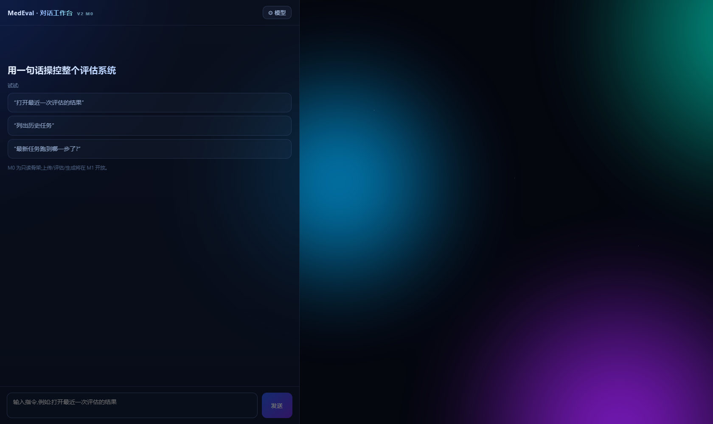
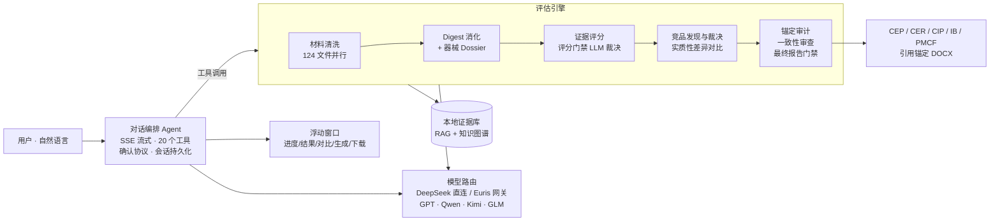

# MedEval — AI-Native 医疗器械申报评估与文档生成工作台

> 用一句话操控整个申报评估系统:上传材料 → 智能清洗 → 循证评估 → 竞品对比 → 结果追问 → 生成 CEP/CER 申报文档草稿。
> 全流程由大模型驱动(AI-native,无关键词规则兜底决策),全程降级透明、重操作确认、引用可追溯。

**本仓库为项目展示页,不包含核心代码。**

---

## 它是什么

MedEval 是一个**本地优先**的医疗器械申报辅助工作台,面向 FDA 510(k) / PMA / BDD、EU MDR、NMPA 五个申报路径:

- **像用 ChatGPT 一样用它**:入口是对话界面,自然语言即操作;执行功能时自动弹出可拖拽的浮动窗口实时展示
- **AI-native 流水线**:材料消化(digest)→ 器械档案(dossier)→ 证据评分 → 竞品裁决与实质性差异对比 → 锚定审计 → 一致性审查,每一步由大模型判断,不用硬编码关键词过滤
- **循证文档生成**:基于结构化证据单元生成 CEP/CER/CIP/IB/PMCF 草稿,逐段引用锚定到源文件具体位置,引用不可解析则质量门禁直接拦截

## 界面速览

### 对话驱动 + 确认协议 + 实时进度

重量级操作(启动评估/生成文档)和破坏性操作(删除/清理/取消)由编排层强制拦截,弹出确认卡,用户点击后才真正执行——不依赖模型自觉。长任务的里程碑自动播报进对话流。

### 评估结果窗口:评分环 · 降级透明 · 维度下钻

每个环节标明是"大模型完成"还是"脚本兜底"(绿/黄徽章);维度行可展开评价叙述与强弱项;竞品卡片点击直达完整对比。

### 竞品实质性差异(非参数对齐)

对比意见按"事实 → 机理 → 审评后果"组织,例如指出对照器械公开技术数据缺失将导致等同性论证停留在适应症和名义尺寸层面。

### 文档生成:质量门禁诚实拦截

材料证据不足时,正式文档会被 `ungrounded_document` 门禁拦截并给出补料建议——宁可不出文档,不出无据文档。证据充分时产出带完整引用映射的 DOCX/Markdown。

### 模型路由:DeepSeek 直连 + Euris 中转网关

编排 Agent 与评估/生成全阶段模型可一键切换并保持对齐:GPT、Qwen、Kimi、GLM、DeepSeek 系均可选,网关模型列表实时发现,密钥全程留在服务端。

### 专业报告视图(经典模式)与移动端

<table>
  <tr>
    <td width="62%"></td>
    <td width="38%"></td>
  </tr>
</table>

---

## 架构概览

## 设计原则

| 原则 | 落地方式 |
|---|---|
| **AI-native** | 选择、过滤、裁决一律由大模型完成;工具描述即路由 Prompt;评分门禁的临床证据判定由模型裁决,关键词扫描仅作无模型时兜底 |
| **降级透明** | 清洗/消化/评分/竞品甄别每一环节标注 `llm` 或 `fallback`,前端徽章可见,绝不静默降级 |
| **重操作确认** | 编排层强制 confirm ticket:模型调用重量级/破坏性工具会被拦截弹卡,用户点击才执行 |
| **引用可追溯** | 生成文档逐段编号引用 → 证据单元 → 源文件位置;引用为零直接拦截 |
| **本地优先** | 材料、证据库、会话全部本地存储;模型密钥不出服务端 |

## 实测数据(FDA 公开示例 eSTAR,169MB / 124 文件)

- 材料清洗:**约 7 分钟**(124 文件全量并行,0 失败)
- 完整评估:**约 22 分钟**(竞品裁决 10 个实体、拒绝 225 条噪声记录、3 份深度对比、锚定审计 18/0、知识图谱 600 断言)
- CEP 生成:**约 30 分钟**(24 章节、3 并行写作子代理、交叉一致性审查含一轮返工、38 条可解析引用、质量门禁通过)

## 状态

- 定位:**专家辅助草稿引擎**——产出需由法规事务(RA)专业人员复核,不构成申报建议
- 界面:对话工作台(v2,主入口)+ 经典专业界面(保留)双模式
- 核心代码目前为私有仓库;本仓库仅作项目展示,合作或试用请通过 Issue 联系

## 技术栈

FastAPI · React 19 + Vite · SSE 流式 + OpenAI 工具调用协议 · 本地混合 RAG(词法+语义)· 知识图谱 · DeepSeek / Euris 模型网关(GPT/Qwen/Kimi/GLM)· Playwright 全流程旅程回归
