<div align="center">

# ⬡ MEDEVAL ⬡

### ⟢ AUTONOMOUS REGULATORY INTELLIGENCE ⟣
#### 医疗器械申报评估 · 自主循证文档生成工作台 · demo：xiaoyuu.me

<br/>


<br/>

```
   ╔══════════════════════════════════════════════════════════════════════╗
   ║   CURATE ▸ PLAN ▸ FREEZE ▸ RETRIEVE ▸ WRITE ▸ REVIEW ▸ GATE ▸ COMPLETE ║
   ║   语料预筛  自主大纲  事实冻结  工具检索  多智能体  审查  门禁  信息补全 ║
   ╚══════════════════════════════════════════════════════════════════════╝
```

> **一句话操控整条申报流水线** — 上传材料 ▸ 智能清洗 ▸ 循证评估 ▸ 竞品对比 ▸ 结果追问 ▸ **自主生成 CEP / CER / CIP / IB / PMCF 草稿** ▸ **缺口两层补全**。
> 全流程大模型驱动 · 引用锚定源文件 · 降级透明 · 重操作确认 · 本地优先。

**⚠ 本仓库为项目展示页,不含源码。**

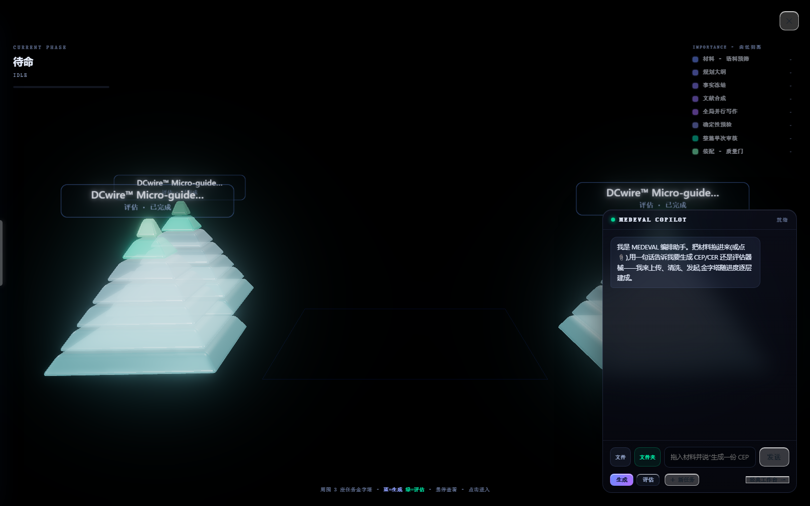

</div>

---

## ✦ v1.36u 更新 ── 玻璃质感界面 · 双模式 · 文档类型对齐 `全界面玻璃 · 3D 物理 · CER/CIP 同级`

> 界面层全面重塑 + 文档能力对齐:统一钢蓝色系的近全透明玻璃皮肤覆盖全部窗口/按钮/标签,
> CER 与 CIP 按国际指南提升到与 CEP 同级的资产深度。

- **🧊 全界面玻璃质感** — 背景折射(backdrop-filter)+ 白色棱边反射环(常态流转 / 指针跟随 / 悬停增强)+ 菲涅尔 sheen + 磨砂噪点;所有窗口与标签具备**随鼠标重心偏移的双层 3D 物理**,倾角按元素尺寸自适应。
- **🔺 双模式互通** — 金字塔模式(COPILOT 一句话编排,任务随流水线逐层建成,蓝=生成 / 绿=评估,工作台任务同样入场)与经典工作台(五阶段精细控制,悬浮自动收纳的历史任务玻璃侧栏)。
- **📋 CER / CIP 提升至 CEP 同级** — 三类均为 24 规范章节 + 24 条章节关系;CER 按 MEDDEV 2.7/1 rev4 补齐评估者资质与利益声明等 4 章,CIP 按 ISO 14155:2020 Annex A 补齐随机化 / 器械可追溯 / 保险等 6 章,并新增 ISO 14155 正则检查表(20 项,终审 advisory)与零引用阻断门。
- **⚡ 任务详情 149s → 5.5s** — async 阻塞事件循环改线程池 + `document_nodes.raw_document_id` 补索引(3100 万次全表行读 → 索引查找)。
- **📦 服务器部署包** — Ubuntu 一键 `install.sh` / systemd 单元 / Nginx 反代 / 8核8G 调优,见 `deploy/`。

<div align="center">

`v1.36u = 玻璃物理界面 · 金字塔+工作台双模式 · CEP/CER/CIP 三类同级 · 149s→5.5s`

</div>

---

## ✦ v1.36 更新 ── 架构整固与自足化 `巨类拆分 · 依赖归零 · 零行为变更`

> 不加功能的工程版:在完整回归测试网(离线 · 屏蔽真实 LLM 调用 · 带超时)保护下,
> 按**真实职责边界**拆分最大的几个"上帝文件",移除外部依赖让系统完全自足 —— 全程**零行为变更**。

| 模块 | 拆分前 | 拆分后 | 依据 |
|:--|--:|--:|:--|
| 证据库 `evidence_repository` | 4218 | **888** | 检索 / 写入 / 纯工具三向分离(mixin + utils) |
| 评估路由 `routers/evaluation` | 3307 | **655** | HTTP 端点 ↔ 检索·评估流水线剥离 |
| 评估器 `evaluator` | 3550 | **1836** | 无状态 helper 独立成模块 |
| 数据清洗 `data_agent` | 3094 | **2529** | 34 个无状态方法抽离 |

- **🧩 真边界拆分,不为凑行数** — 沿"变化原因不同"的职责切开;对确属内聚复杂度 + 全局可变状态的核心流水线,**诚实地不做机械硬拆**(避免把耦合藏进脆弱的反向指针)。
- **📦 外部依赖归零** — 联网检索 CLI 从外部安装目录打包进项目 `vendor/`,系统完全自足;顺带修复一处潜伏的循环导入。
- **🔒 攻击面收敛** — 移除可选 API-Token 鉴权链(本地优先工具无需),`ruff` 清理 100+ 未用导入。
- **✅ 测试网护航** — CI 安全的离线回归套件逐步验证,每步全绿;外部导入面通过 re-export 完全不变。

<div align="center">

`v1.36 = 巨类按真实边界拆分 · 外部依赖归零 · 自足化 · 零行为变更`

</div>

---

## ✦ v1.35r 更新 ── 生成后信息补全代理 `两层取证 · 医疗数据库联网`

> 生成出的草稿里每一个 `[MISSING: …]` 缺口,交给一个**可选**的补全代理去填:
> 先在**已上传语料里再检索**(逐字引文接地才采纳),仍缺的**外部背景类**缺口再走
> **联网医疗数据库**收集。原稿永不被改,另存补全版文档 + 分类补料清单。

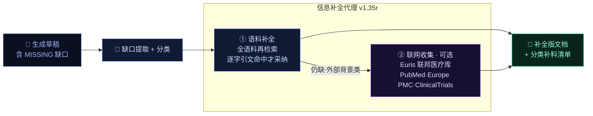

| 层 | 数据源 | 补什么 | 严格性保证 |
|:--:|---|---|---|
| ① **语料补全** | 已上传材料 | 检索漏网的**自家事实**(器械名、指标、指征…) | 每条填充必须**逐字命中源文**,否则保留 `[MISSING]` —— 只捞回,不编造 |
| ② **联网收集** | **Euris 联邦医疗库**(PubMed · Semantic Scholar · Europe PMC · ClinicalTrials · openFDA · eCFR · EUDAMED) | **仅外部背景**:已发表文献 / 标准指南 / 流行病学·SOTA / 竞品前代 | **领域锚定检索**(疗法+适应症关键词);自家器械/临床事实**一律不联网**;每条带真实来源(DOI/PMC)+ `[AUTO-COLLECTED · 待核实]` 标注,**不混入 mkb_ 引用体系** |

**默认关闭联网**,一次调用显式开启;实测同案例(DBS 治疗阿片使用障碍):把散落 54 处缺口自动归为分类补料清单,语料捞回检索漏网项,联网从 **PubMed / Europe PMC 收到真临床 SOTA**(如 *Deep Brain Stimulation for Addictive Disorders*)带 DOI 接地。

**同版可靠性加固**:LLM 传输重试从 3 次/6 秒 → **指数退避 ~60 秒**,扛过供应商 ~1 分钟连接抖动(此前会把大批章节写成空桩);质量门在**大面积写手传输失败**时拦截交付,不再把掏空文档当成品发货;器械名/厂商前置页识别修复。

<div align="center">

`v1.35r = 缺口两层补全 · 医疗数据库联网取证 · 领域锚定 · 护栏严 · 传输韧性`

</div>

---

## ✦ v1.34r 更新 ── 生成覆盖·压缩·稳定 `证据蒸馏 · 硬超时`

> 把"每段拿几十万字全文"换成"每段拿压缩后的带引文摘要",既根治信息卡没、又让写作更稳更快。

| 能力 | 做了什么 | 效果 |
|:--:|---|---|
| 🧪 **抽取式证据蒸馏** | 每个源→(事实 + **逐字引文** + 领域)单元,逐字引文必须命中源文才保留 | 写手输入**瘦身约 10×**,接地 100%,快模型并行 |
| 📤 **去掉 8 源上限** | 每段拿到**全部相关源**(含 SOTA 文献),不再静默丢弃 | **根治"信息卡没"**,引用数显著提升 |
| ⏱ **Wall-clock 硬超时** | 推理模型 trickle 字节不再让 read-timeout 失效、挂死整篇 | 单段卡住→重试→标记,不拖垮全文 |
| 👁 **视觉 OCR + 打标签提速** | 扫描件 kimi 视觉直读(网关文档/图像块)、整文件打标签、双趟解析结果缓存去重 | 扫描件可读、读取阶段大幅提速 |
| 🛡 **结构段·器械名·DOC- 修复** | GSPR 结构段不再落空、器械名从结构化单元恢复、文档级 DOC- 引用可解析 | 前置件与追溯表齐整 |

<div align="center">

`v1.34r = 证据蒸馏压缩 · 去源上限根治卡没 · 硬超时稳定 · 视觉 OCR`

</div>

---

## ✦ v1.33 更新 ── AGENT-NATIVE 评估引擎 `联网循证`

> 评估侧完成与生成侧的同构:大模型主导**调查 → 取证 → 评审**。
> 事实主干不再是上传材料的自说自话,而是**联网检索的确凿证据——竞品、官方标准、临床文献**。

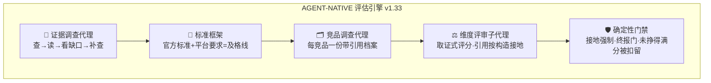

| 代理 | 做什么 | 严格性保证 |
|:--:|---|---|
| 🔎 **证据调查** | 按维度×证据线(竞品/标准/文献)迭代联网检索,覆盖矩阵闭合才收工 | 查不到的**显式登记缺口**,禁止静默 |
| ⚖️ **维度评审** | 每维度一个代理:先读标准框架,再自主检索证据包,读过全文才允许判断 | **引用按构造接地**——只能引用自己检索到的证据,伪造在结构上不存在 |
| 🗂 **竞品调查** | 每个裁决后的竞品深挖一份档案:K号/法规状态/技术特征/实质差异,全带引用 | 零可解析引用的档案**自动降为背景资料** |
| 🛡 **门禁不变** | 接地强制、竞品裁决、终报门一行未删,agent 产出过同样的门 | 一切降级显式标记,`scored_by` 可见 |

**真实 A/B(同器械同材料)**:检索证据 `193 vs 48` · 官方标准 `8 项(含 21 CFR 870.1330 精确条款) vs 0` · 竞品 `6 个带真实 K 号 + 3/3 接地档案 vs 验证 0 证据` · 评分 `18/18 条可解析引用,4 维度代理零兜底`。

同版亮相:**⬡ 3D 玻璃金字塔工作台** —— 每次评估/生成随真实进度逐层建成的玻璃金字塔(Three.js,透明玻璃质感+边角线辉光),内嵌 LLM 对话编排:拖入材料、聊天发起、档案确认卡、竞品档案面板、实时进度,全程不离开金字塔。

<div align="center">

`v1.33 = 联网确凿证据主干 · 取证式评审 · 引用按构造接地 · 玻璃金字塔工作台`

</div>

---

## ✦ 自主生成引擎 ── 它怎么写出一份 CEP

```mermaid
flowchart LR
    UP[(上传材料<br/>N 份原始文件)]:::src --> CU
    subgraph ENGINE [AGENT-NATIVE 生成引擎]
        direction LR
        CU[🗂 语料预筛<br/>相关度排序<br/>汰噪留核心]:::new
        DS[🧪 证据蒸馏<br/>事实+逐字引文单元]:::new
        PL[🧭 规划器 Agent<br/>按材料定大纲<br/>依赖图 · 深度配额]:::ag
        FS[❄ 事实冻结<br/>fact-sheet]:::ag
        W[✍ 写作子代理 xN<br/>拓扑分波并行<br/>工具检索材料]:::ag
        R[⟲ 审查循环<br/>reviewer + 防线]:::ag
        CR[⚖ 文档评审官<br/>跨章一致性]:::ag
        AS[📑 装配<br/>前置件 + 编号书目]:::new
        G[🛡 确定性质量门<br/>引用接地 · 零引用即拦截]:::gate
        CU --> DS --> PL --> FS --> W --> R --> CR --> AS --> G
    end
    G -->|passed| DOC[📄 CEP / CER / CIP / IB / PMCF<br/>引用锚定 Markdown + DOCX]:::out
    DOC -.可选.-> IC[🧩 信息补全代理<br/>语料 + 医疗库联网]:::new
    G -->|ungrounded| BLK[⛔ 诚实拦截 + 补料建议]:::blk

    classDef src fill:#0b1020,stroke:#3a4a80,color:#9fb4ff
    classDef ag fill:#101a33,stroke:#6c8cff,color:#cfe0ff
    classDef new fill:#161033,stroke:#b06cff,color:#e6d4ff
    classDef gate fill:#1a1030,stroke:#b06cff,color:#e6d4ff
    classDef out fill:#08251c,stroke:#00e5a0,color:#9affd8
    classDef blk fill:#2a0f1a,stroke:#ff5c8a,color:#ffb3c9
```

### ⟢ 核心不变量

| 不变量 | 机制 |
|---|---|
| **硬引用接地** | 每句主张锚定真实材料 chunk id;运行时 seen-set 只允许引用真实检索到的证据 —— **引用不可伪造** |
| **零幻觉** | 材料没有的事实一律写成 `[MISSING: …]`,绝不编造研究/数字;补全代理只**逐字接地**捞回或联网带真实来源 |
| **诚实门禁** | 引用为零的"空壳文档"被 `ungrounded_document` 直接拦截;大面积写手传输失败也拦截 —— 宁可不出,不出无据 |
| **跨章一致** | 文档评审官单遍通读全文,统一术语、消除矛盾,再装配 |
| **断点续跑** | 大纲 / 事实表 / 证据蒸馏 / 每章结果落盘,重跑只补失败章节 |
| **双引擎** | `agent_native`(智能,默认)+ `section_first`(快速兜底) |

---

## ✦ 两种使用模式

### 🔺 金字塔模式 ── 对话编排 · 3D 任务实景
打开应用即进入 3D 场景:把材料拖给右下角 COPILOT,一句"生成一份 CEP"或"评估这个器械"即可发起——**运行中的任务化作场景中心的金字塔,随流水线阶段逐层建成**;完成的任务(含工作台发起的)凝固为独立金字塔留在四周,**蓝=文档生成、绿=器械评估**,点塔即恢复对应会话与结果。


### 🖥 经典工作台模式 ── 五阶段精细控制
评估走**上传 → 智能整理 → 信息确认 → 评估 → 结果解读**,生成走**上传 → 暂存整理 → 章节生成**;每一步产物以独立悬浮玻璃窗展开。**逐阶段模型路由**(读取 / 检索 / 评分 / 生成分别指定模型)、历史任务悬浮玻璃侧栏(离开自动收纳、贴左缘唤回)、交付健康角标、亮暗双主题(`?theme=dark|light` 深链)。

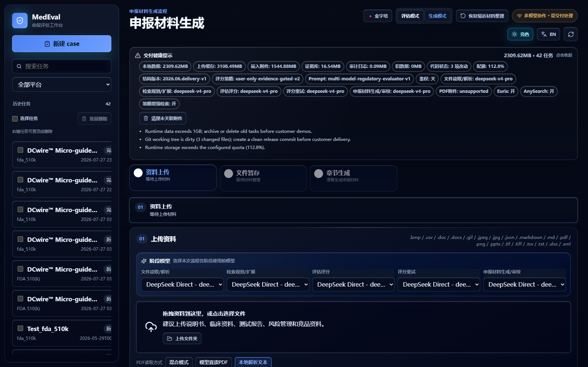
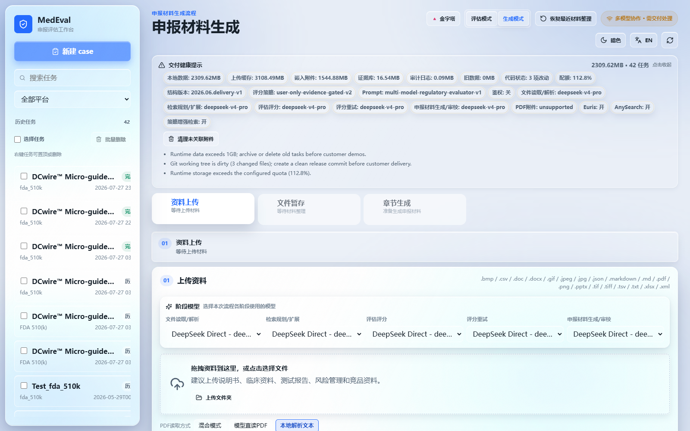

---

## ✦ 界面速览

### 对话驱动 · 确认协议 · 实时进度
重量级操作(启动评估 / 生成)和破坏性操作由编排层强制拦截弹卡,用户点击才执行 —— 不靠模型自觉。长任务里程碑自动播报进对话流。

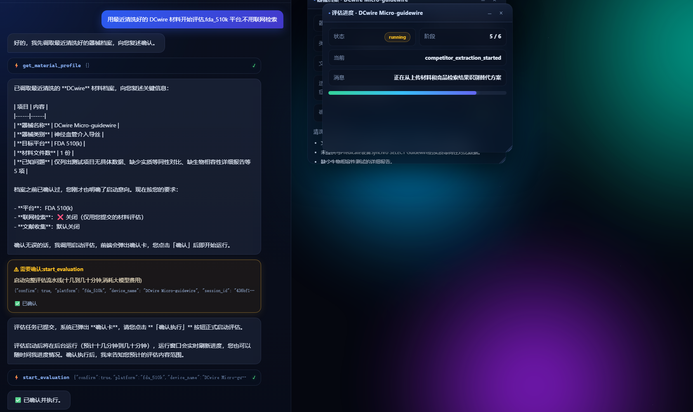

### 评估结果 · 评分环 · 降级透明 · 维度下钻
每环节标明"大模型完成"还是"脚本兜底"(绿 / 黄徽章);维度行可展开评价叙述与强弱项。

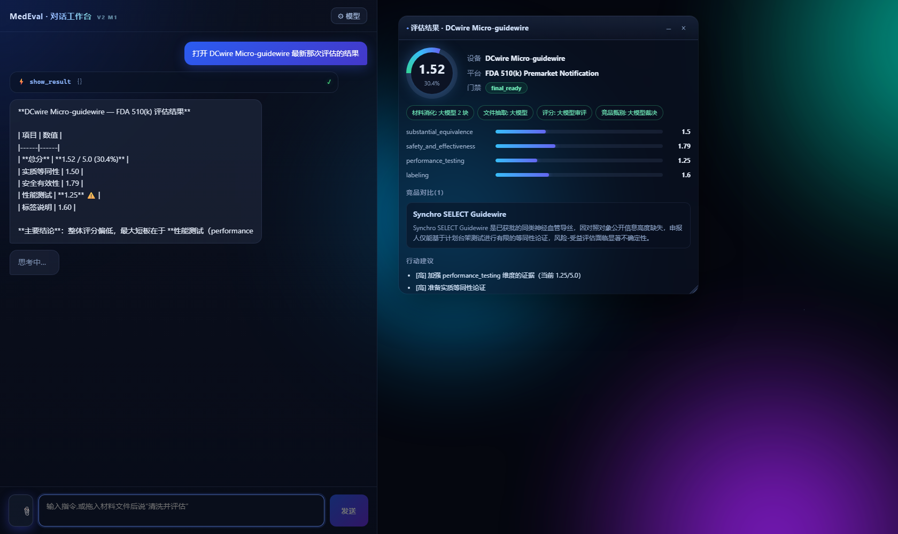

### 竞品实质性差异(非参数对齐)
对比意见按"事实 → 机理 → 审评后果"组织,直指对照器械数据缺口对等同性论证的影响。

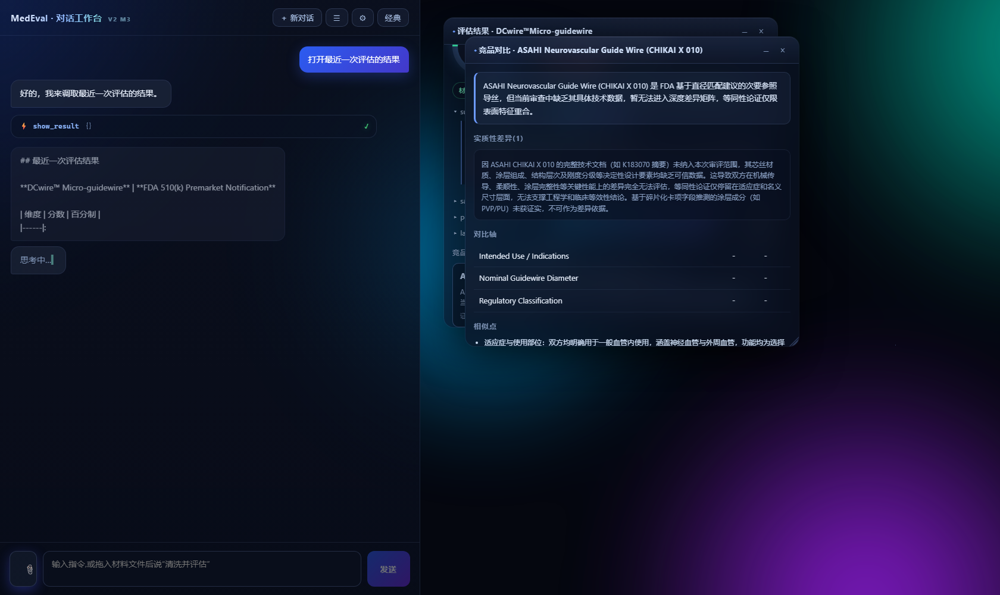

### 文档生成 · 质量门禁诚实拦截
材料不足被 `ungrounded_document` 拦截并给补料建议;证据充分则产出带完整引用映射的 DOCX / Markdown。

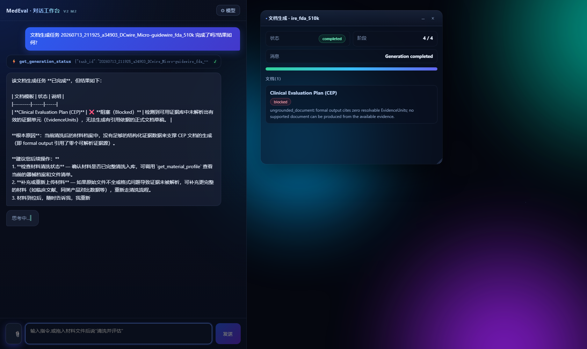

### 模型路由 · DeepSeek 直连 + Euris 中转网关
编排与评估 / 生成全阶段模型一键切换并保持对齐:GPT · Qwen · Kimi · GLM · DeepSeek 系均可选,密钥全程留在服务端。

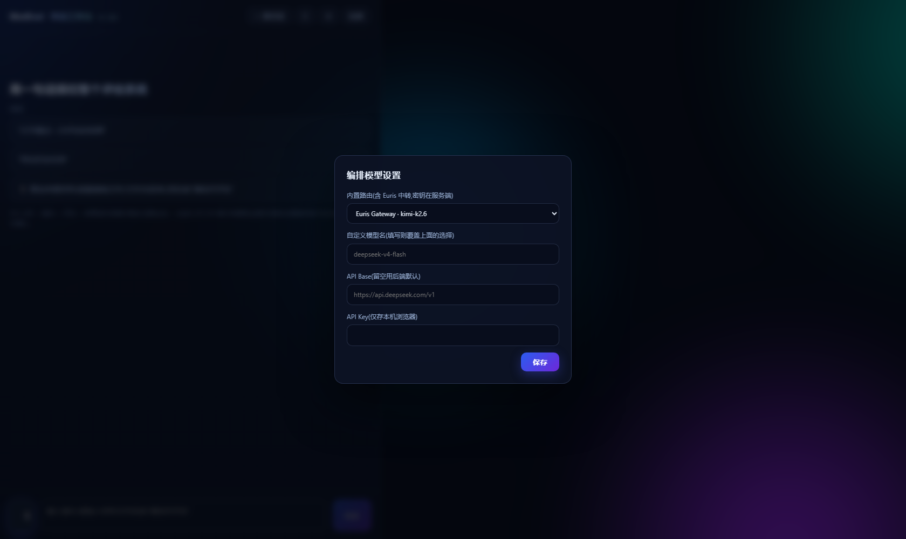

### 专业报告视图(经典模式)与移动端
<table>
  <tr>
    <td width="62%">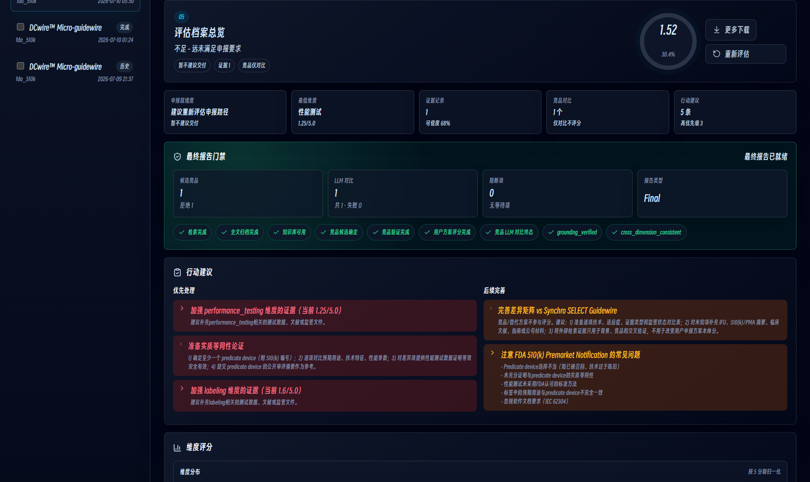</td>
    <td width="38%">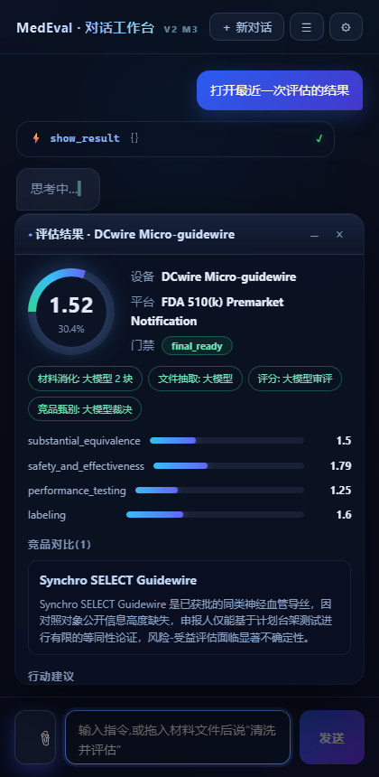</td>
  </tr>
</table>

---

## ✦ 系统架构总览

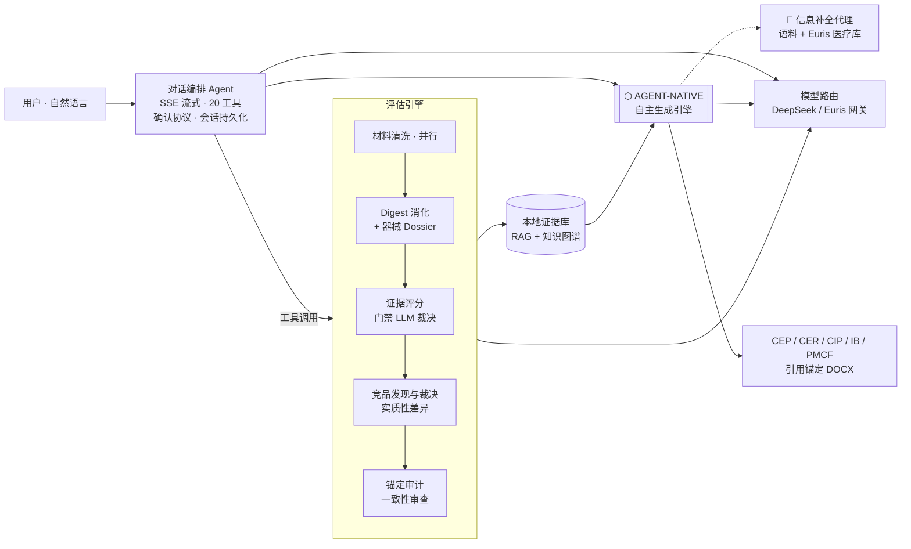

## ✦ 设计原则

| 原则 | 落地方式 |
|---|---|
| **AI-native** | 选择 / 过滤 / 裁决一律大模型完成;工具描述即路由 Prompt;关键词扫描仅作无模型兜底 |
| **降级透明** | 每环节标注 `llm` 或 `fallback`,前端徽章可见,绝不静默降级 |
| **重操作确认** | 编排层强制 confirm ticket:重量级 / 破坏性工具被拦截弹卡,点击才执行 |
| **引用可追溯** | 生成文档逐段编号引用 → 证据单元 → 源文件位置;引用为零直接拦截 |
| **本地优先** | 材料、证据库、会话全部本地存储;模型密钥不出服务端 |

## ✦ 状态

- 定位:**专家辅助草稿引擎** —— 产出需由法规事务(RA)专业人员复核,不构成申报建议
- 生成引擎:六模板全接入(CEP · CER · CIP · IB · PMCF Plan · PMCF Synopsis),`agent_native` 为默认智能引擎;**生成后信息补全代理**(语料 + Euris 医疗库联网)可选
- 评估引擎:agent-native 联网循证(证据调查/维度评审/竞品调查三类代理 + 确定性门禁)
- 界面:3D 玻璃金字塔工作台(默认落地,内嵌对话编排)+ 经典专业界面双模式
- 核心代码为私有仓库;本仓库仅作项目展示,合作或试用请通过 Issue 联系

## ✦ 技术栈

`FastAPI` · `React 19 + Vite` · `SSE 流式 + OpenAI 工具调用协议` · 多智能体编排(语料预筛 / 证据蒸馏 / 规划 / 事实冻结 / 写作 / 审查 / 评审官 / 信息补全)· 本地混合 RAG(词法 + 语义)· 知识图谱 · `Euris 联邦医疗库`(PubMed / Europe PMC / ClinicalTrials / openFDA)· `DeepSeek / Euris` 模型网关(GPT / Qwen / Kimi / GLM)· CUDA 常驻 OCR + 扫描件视觉直读 · Playwright 全流程旅程回归

<div align="center">
<br/>

**⬡ MEDEVAL v1.36 ⬡**

`⟢ built for regulatory-grade evidence, not vibes ⟣`

</div>
